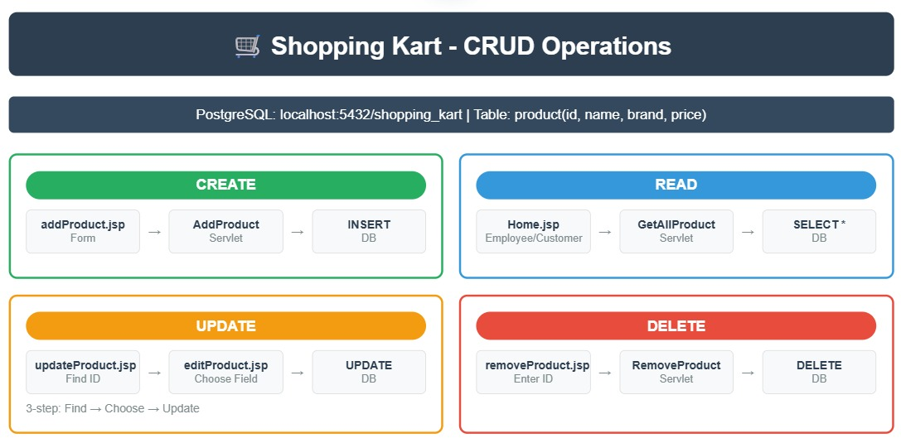

# ShoppingKart Project 🛒

A **Java Full Stack Web Application** for managing products with full **CRUD (Create, Read, Update, Delete)** functionality.  
Built using **Java Servlets, JSP, JDBC, PostgreSQL**, and **HTML/CSS**.

---

## 🚀 Features
- **Add Product** – Insert new products into the system
- **View Products** – Employee and Customer views for listing all products
- **Update Product** – Two-step update flow (choose product → select field → modify value)
- **Delete Product** – Remove products by ID
- **Validation** – Server-side checks for product fields

---

## 🛠️ Tech Stack
- **Frontend:** JSP, HTML, CSS
- **Backend:** Java Servlets, JDBC
- **Database:** PostgreSQL
- **Server:** Apache Tomcat (tested on v9)
- **IDE:** VS Code / Eclipse

---

## 📂 Project Structure
```
ShoppingKartProject/
 ├── src/com/qsp/Product/        # Product CRUD servlets + model
 ├── src/com/qsp/Customer/       # Customer handling (login, signup)
 ├── src/com/qsp/Employee/       # Employee handling (login, signup)
 ├── WebContent/
 │    ├── *.jsp                   # JSP pages for UI
 │    ├── css/                    # Stylesheets
 │    └── images/                 # Assets
 └── database/                    # PostgreSQL schema
```

---

## ⚙️ Setup Instructions

1. **Clone Repository**
   ```bash
   git clone https://github.com/SuhasMali12/ShoppingKartProject.git
   ```

2. **Database Setup (PostgreSQL)**
   - Create database:
     ```sql
     CREATE DATABASE shopping_kart;
     ```
   - Create table:
     ```sql
     CREATE TABLE product (
       id INT PRIMARY KEY,
       name VARCHAR(50),
       brand VARCHAR(50),
       price DOUBLE PRECISION
     );
     ```

3. **Configure JDBC in Code**
   In `AddProduct.java` and other servlets:
   ```java
   String url = "jdbc:postgresql://localhost:5432/shopping_kart?user=postgres&password=root";
   ```

4. **Deploy on Tomcat**
   - Copy project to `webapps/` folder of Tomcat
   - Start Tomcat server
   - Visit: `http://localhost:8080/ShoppingKartProject`
---

## 📊 CRUD Dataflow
Below diagram shows how Product operations flow through JSP → Servlet → JDBC → PostgreSQL.



## 🤝 Contribution
Pull requests are welcome!  
For major changes, please open an issue first to discuss what you’d like to change.

---

## 👨‍💻 Author
- **Suhas Mali**
- GitHub: @SuhasMali12
- Built as part of Java Full Stack Development course @ QSpiders

---
